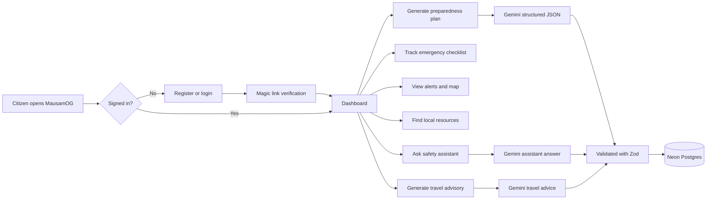
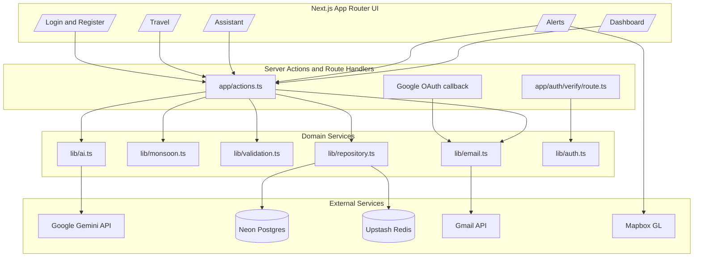
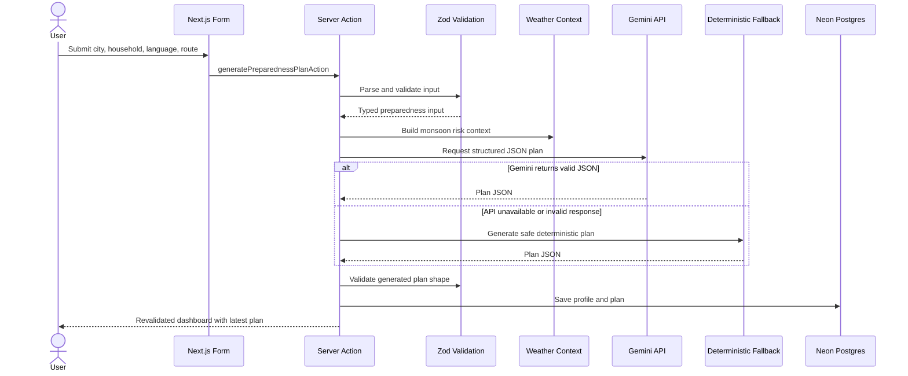
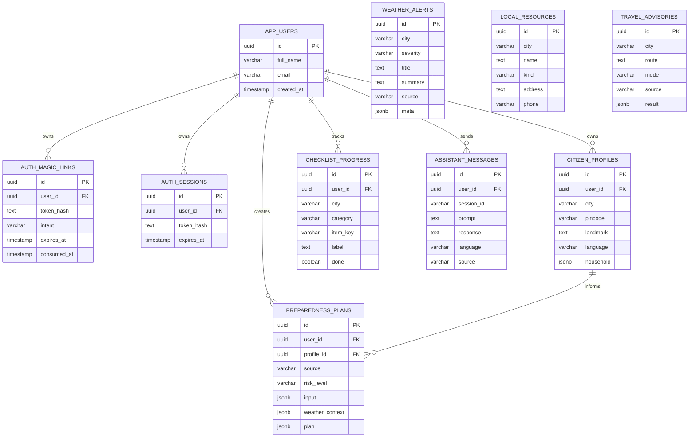

# MausamOG

MausamOG is a GenAI-powered monsoon preparedness and citizen assistance command center. It helps citizens build a localized safety plan, track emergency readiness, inspect city alerts, get route-aware travel advice, and ask a multilingual monsoon safety assistant for practical guidance.

The app is built with Next.js App Router, Server Actions, TypeScript, Neon Postgres, Drizzle ORM, Upstash Redis, Google Gemini, Gmail OAuth, Mapbox, Tailwind CSS, Zod, and Vitest.

## What It Does

- Generates personalized monsoon preparedness plans from city, pincode, landmark, household, language, flood-risk, and travel context.
- Shows a readiness dashboard with active alerts, checklist progress, local resources, and the latest AI-generated plan.
- Provides a multilingual assistant for concise citizen-safety answers.
- Creates travel advisories for routes and travel modes during monsoon conditions.
- Displays localized alert markers on a Mapbox-powered risk map.
- Supports magic-link login/signup through Gmail OAuth, with demo-link fallback when email is not configured.
- Persists users, sessions, plans, checklists, alerts, resources, travel advisories, and assistant messages in Postgres.
- Uses Redis for alert caching and assistant rate limiting.
- Includes deterministic fallbacks so the demo remains usable when external services are unavailable.

## Product Flow



## Architecture



## AI Request Lifecycle



## Data Model



## Tech Stack

| Layer | Tools |
| --- | --- |
| Framework | Next.js App Router, React, TypeScript |
| Styling | Tailwind CSS, custom CSS variables |
| AI | Google Gemini API, deterministic fallback generators |
| Validation | Zod schemas for form input and AI output |
| Database | Neon Postgres with Drizzle ORM |
| Cache and limits | Upstash Redis |
| Email auth | Gmail API with OAuth refresh token |
| Maps | Mapbox GL |
| Tests | Vitest |

## Routes

| Route | Purpose |
| --- | --- |
| `/` | Main readiness dashboard |
| `/alerts` | Alert list and Mapbox risk view |
| `/assistant` | Multilingual monsoon safety assistant |
| `/checklist` | Emergency readiness checklist |
| `/resources` | Local shelters, hospitals, helplines, and support points |
| `/travel` | Route and commute safety advisory |
| `/login` | Magic-link login |
| `/register` | Magic-link signup |

## Environment Variables

Create `.env` in the project root. Use real values for production, and omit optional integrations locally if you want to rely on fallbacks.

```bash
DATABASE_URL=

GEMINI_API_KEY=
GEMINI_MODEL=gemini-2.5-flash

UPSTASH_REDIS_REST_URL=
UPSTASH_REDIS_REST_TOKEN=

NEXT_PUBLIC_APP_URL=http://localhost:3000
NEXT_PUBLIC_MAPBOX_TOKEN=

GMAIL_CLIENT_ID=
GMAIL_CLIENT_SECRET=
GMAIL_REDIRECT_URI=http://localhost:3000/api/auth/callback/google
GMAIL_REFRESH_TOKEN=
GMAIL_FROM="MausamOG <your-gmail-address@gmail.com>"
```

## Local Development

Install dependencies:

```bash
pnpm install
```

Start the development server:

```bash
pnpm dev
```

Open:

```text
http://localhost:3000
```

Seed demo data:

```bash
pnpm seed
```

Run tests:

```bash
pnpm test
```

Build for production:

```bash
pnpm build
pnpm start
```

## Gmail OAuth Helper

Generate a Gmail consent URL:

```bash
pnpm gmail:auth-url
```

Exchange an authorization code for a refresh token:

```bash
$env:GMAIL_AUTH_CODE="paste-code-here"; pnpm gmail:exchange
```

The app can still run without Gmail configuration. In that case, login and signup return a demo magic link instead of sending an email.

## AI Safety and Reliability

- Gemini responses are requested as structured JSON for preparedness plans and travel advisories.
- Generated responses are parsed and validated before being saved.
- The assistant response is capped before persistence.
- Fallback generators provide safe, practical monsoon guidance when Gemini is unavailable.
- Assistant calls can be rate-limited with Redis.
- The app avoids pretending to dispatch emergency services and directs users to official emergency channels for active emergencies.

## Project Structure

```text
app/
  actions.ts                  Server actions for auth, plans, checklist, travel, assistant
  components/                 Reusable dashboard, map, and form components
  alerts/                     Alert and risk-map page
  assistant/                  Multilingual assistant page
  checklist/                  Emergency checklist page
  resources/                  Local resources page
  travel/                     Travel advisory page
lib/
  ai.ts                       Gemini calls and AI fallback routing
  auth.ts                     Magic-link tokens and session helpers
  db.ts                       Neon/Drizzle connection
  email.ts                    Gmail OAuth email sender
  monsoon.ts                  Weather context and deterministic plan logic
  redis.ts                    Upstash Redis client
  repository.ts               Data access layer and schema bootstrap
  schema.ts                   Drizzle tables and shared domain types
  validation.ts               Zod input and output schemas
scripts/
  seed.ts                     Seed alerts, checklists, and resources
  gmail-oauth.ts              Gmail OAuth URL and token exchange helper
data/seed/
  alerts.json
  checklist.json
  resources.json
```

## Submission Notes

Copy-ready submission answers are included in:

- `submission-deployed-version-updates.txt`
- `submission-genai-services-utilized.txt`

They are written to fit a 1024-character form field limit.
